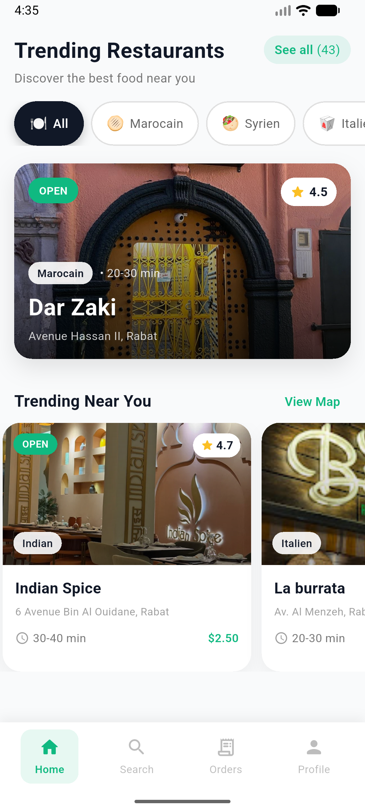
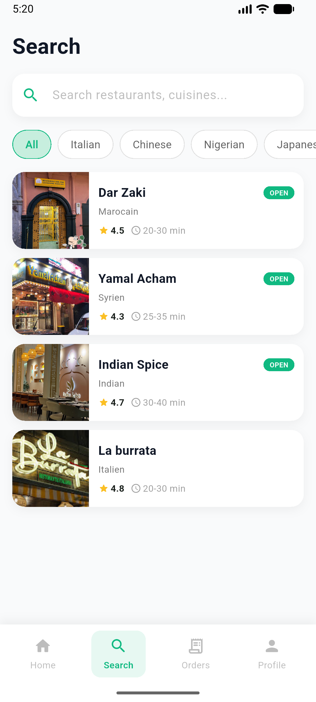
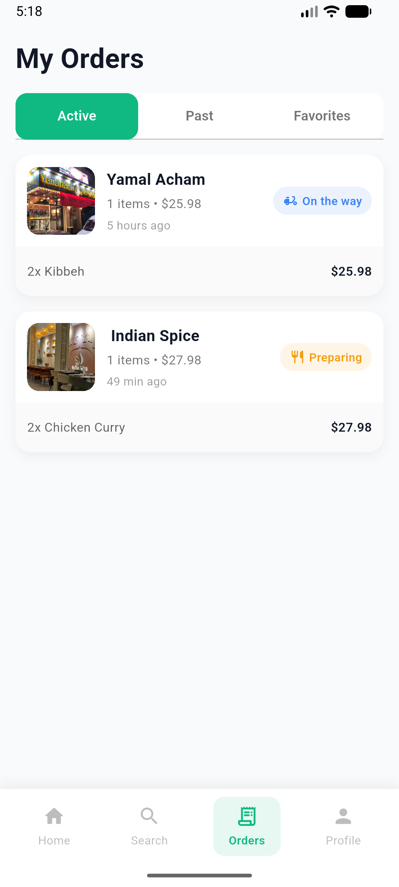

# 🍽️ RabatBites – Restaurant Discovery App

 


RabatBites est une application Flutter pour **découvrir et commander des plats à Rabat**, avec plusieurs cuisines disponibles : Marocain, Syrien, Indien, Chinois, et plus.  

---

## 🎬 App Preview

<p align="center">
  
  
  
</p>

---

## 📱 Écrans principaux

1. **Home Screen**
   - Restaurants en tendance
   - Catégories de cuisines (Marocain, Syrien, Indien, Chinois…)
   - Cartes de restaurants avec badge **OPEN** et notation en étoiles  

2. **Search Screen**
   - Recherche en temps réel
   - Filtres par type de cuisine
   - Résultats en liste verticale  

3. **Orders Screen**
   - Onglets : Actives, Passées, Favoris
   - Statut des commandes (Livré, En route, Préparation)  

4. **Profile Screen**
   - Profil utilisateur, commandes, favoris
   - Menu de réglages  

5. **Restaurant Detail Screen**
   - Image du restaurant avec overlay
   - Menu et items avec ajout au panier
   - Checkout  

---

## 🎨 Fonctionnalités clés

- Catégories de cuisines scrollables horizontalement  
- Cartes de restaurants stylées avec coins arrondis et badges  
- Système de panier complet : ajout, consultation, checkout  
- Navigation facile : Bottom Navigation (Home, Search, Orders, Profile)  
- UI moderne : Material 3, couleurs harmonieuses, badges colorés  

---

## 🚀 Comment lancer le projet

1. Cloner le repo :
```bash
git clone https://github.com/hbhabiba121-hash/RabatBites.git
cd RabatBites
